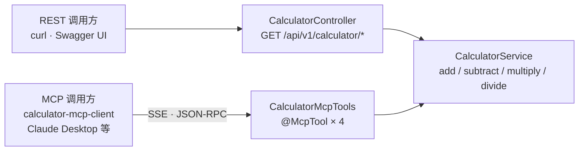
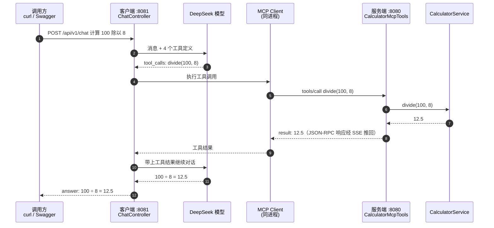

# spring-ai-mcp-calculator

Spring Boot 4 + Spring AI 2 + MCP（Model Context Protocol）四则运算 Demo。

同一个 `CalculatorService` 同时以两种方式对外暴露：

- **REST**：`GET /api/v1/calculator/{add|subtract|multiply|divide}`，配 Swagger UI
- **MCP**：`add` / `subtract` / `multiply` / `divide` 四个工具，通过 SSE 暴露给任意 MCP 客户端

另有一个 MCP Client 模块，用 DeepSeek 驱动，把「自然语言问题」翻译成「调用远端 MCP 工具」。

---

## 1. 技术栈

| 组件 | 版本 | 说明 |
|---|---|---|
| Java | 25 | `maven.compiler.release=25` |
| Spring Boot | 4.0.8 | 注意 starter 改名，见 §5 |
| Spring AI | 2.0.1 | 通过 `spring-ai-bom` 统一版本 |
| springdoc-openapi | 3.1.1 | 官方声明支持 Spring Boot v4 |
| MCP 协议 | 2024-11-05 | 服务端协商出的版本 |

---

## 2. 模块结构

```
spring-ai-mcp-calculator/          父 POM（packaging=pom，聚合两个模块）
├── calculator-mcp-server/           端口 8080 —— MCP Server + REST API + Swagger
│   └── src/main/java/com/example/mcp/server/
│       ├── CalculatorMcpServerApplication.java   启动类
│       ├── service/CalculatorService.java        四则运算业务逻辑（唯一真源）
│       ├── mcp/CalculatorMcpTools.java           @McpTool 工具定义
│       ├── api/CalculatorController.java         REST 接口
│       ├── api/GlobalExceptionHandler.java       RFC 9457 错误响应
│       ├── api/dto/ArithmeticResponse.java       REST 响应体
│       ├── config/OpenApiConfig.java             Swagger 元信息
│       └── exception/DivisionByZeroException.java
└── calculator-mcp-client/           端口 8081 —— MCP Client + DeepSeek 对话
    └── src/main/java/com/example/mcp/client/
        ├── CalculatorMcpClientApplication.java   启动类
        ├── chat/CalculatorChatService.java       ChatClient + MCP 工具
        ├── api/ChatController.java               POST /api/v1/chat
        ├── api/dto/ChatRequest.java / ChatResponse.java
        └── config/OpenApiConfig.java
```

同一个 `CalculatorService`，两条对外暴露路径：



**为什么拆成两个进程？**
MCP 的本质是「客户端通过协议访问独立进程的服务端」。如果把 Client 和 Server 塞进同一个 JVM，Client 必须在 Server 的 HTTP 端点就绪后才能连接，而 `spring.ai.mcp.client.initialized` 默认为 `true`，意味着 Bean 创建阶段就会去 `initialize()` 拉工具列表——此时 MVC 的 SSE 端点处理器可能还没注册。这是一个真实的启动竞态。拆成两个进程既绕开了竞态，也忠实还原了 MCP 的跨进程架构。

---

## 3. 快速开始

### 3.1 构建

```bash
mvn clean package
```

预期：两个模块 `BUILD SUCCESS`，服务端 10 个测试全部通过。

### 3.2 配置 API Key

客户端需要 DeepSeek API Key，通过环境变量注入：

```powershell
# PowerShell（当前会话生效）
$env:DEEPSEEK_API_KEY = "sk-xxxxxxxxxxxxxxxx"

# 永久写入用户环境变量
[Environment]::SetEnvironmentVariable("DEEPSEEK_API_KEY", "sk-xxxxxxxxxxxxxxxx", "User")
```

### 3.3 启动（需要两个终端，先起服务端）

```bash
# 终端 1
java -jar calculator-mcp-server/target/calculator-mcp-server-1.0.0.jar

# 终端 2
java -jar calculator-mcp-client/target/calculator-mcp-client-1.0.0.jar
```

启动成功的标志：服务端日志出现 `Registered tools: 4`；客户端日志出现
`Server response with Protocol: 2024-11-05 ... Info: Implementation[name=calculator-mcp-server...]`。

### 3.4 访问入口

| 用途 | 地址 |
|---|---|
| 服务端 Swagger UI | http://localhost:8080/swagger-ui.html |
| 服务端 OpenAPI JSON | http://localhost:8080/v3/api-docs |
| 客户端 Swagger UI | http://localhost:8081/swagger-ui.html |
| MCP SSE 端点 | http://localhost:8080/sse |

---

## 4. 验证

### 4.1 REST 接口

```bash
curl "http://localhost:8080/api/v1/calculator/add?a=12&b=8"
# {"operation":"add","a":12.0,"b":8.0,"result":20.0}

curl "http://localhost:8080/api/v1/calculator/divide?a=1&b=0"
# HTTP 400
# {"detail":"除数不能为 0","instance":"/api/v1/calculator/divide",
#  "status":400,"title":"非法运算","type":"https://example.com/problems/division-by-zero"}
```

### 4.2 MCP 协议（手工走一遍 JSON-RPC）

```bash
# 第 1 步：打开 SSE 长连接，服务端立刻下发一个 endpoint 事件
curl -N http://localhost:8080/sse
# event:endpoint
# data:/mcp/message?sessionId=<SESSION_ID>
```

拿到 `SESSION_ID` 后，把 JSON-RPC 请求 POST 到 `/mcp/message?sessionId=<SESSION_ID>`：

```bash
curl -X POST "http://localhost:8080/mcp/message?sessionId=<SESSION_ID>" \
  -H "Content-Type: application/json" \
  -d '{"jsonrpc":"2.0","id":2,"method":"tools/list","params":{}}'
```

响应通过刚才那条 SSE 连接推送回来：

```json
{"jsonrpc":"2.0","id":2,"result":{"tools":[
  {"name":"add","description":"计算两个数之和，返回 a + b",
   "inputSchema":{"type":"object","properties":{
     "a":{"type":"number","format":"double","description":"第一个加数"},
     "b":{"type":"number","format":"double","description":"第二个加数"}},
   "required":["a","b"]}},
  ... 共 4 个工具
]}}
```

调用工具：

```bash
curl -X POST "http://localhost:8080/mcp/message?sessionId=<SESSION_ID>" \
  -H "Content-Type: application/json" \
  -d '{"jsonrpc":"2.0","id":3,"method":"tools/call",
       "params":{"name":"add","arguments":{"a":12,"b":8}}}'
```

```json
{"jsonrpc":"2.0","id":3,"result":{"content":[{"type":"text","text":"20.0"}],"isError":false}}
```

除零时走错误分支（`isError: true`，不会抛协议级异常）：

```json
{"jsonrpc":"2.0","id":4,"result":{"content":[{"type":"text","text":"除数不能为 0"}],"isError":true}}
```

### 4.3 LLM 调用 MCP 工具（完整链路）

```bash
curl -X POST http://localhost:8081/api/v1/chat \
  -H "Content-Type: application/json" \
  -d '{"message":"计算 100 除以 8"}'
# {"answer":"100 ÷ 8 = 12.5"}
```

这条请求背后发生的完整链路：



---

## 5. 关键知识点（首次接触 MCP 必读）

### 5.1 MCP 是什么

MCP（Model Context Protocol）是 Anthropic 提出的开放协议，把「模型能用什么能力」标准化成一套 JSON-RPC 契约。核心角色：

- **Server**：声明自己有哪些 **Tools / Resources / Prompts**，等待被调用
- **Client**：连接到 Server，拉取能力清单，替模型执行工具调用
- **Host**：真正跑模型的应用（Claude Desktop、IDE、你自己的 Spring Boot 服务）

本 Demo 里，`calculator-mcp-server` 是 Server，`calculator-mcp-client` 同时扮演 Client，DeepSeek 是模型。

好处是**解耦**：工具提供方不需要知道调用方是谁、用的是哪家模型；换成 OpenAI / Ollama / Claude 只改客户端一行依赖，服务端完全不动。

### 5.2 服务端：一个注解就够了

[CalculatorMcpTools.java](calculator-mcp-server/src/main/java/com/example/mcp/server/mcp/CalculatorMcpTools.java) 的全部工作量就是加注解：

```java
@Component
public class CalculatorMcpTools {

    @McpTool(name = "add", description = "计算两个数之和，返回 a + b")
    public double add(
            @McpToolParam(description = "第一个加数", required = true) double a,
            @McpToolParam(description = "第二个加数", required = true) double b) {
        return calculatorService.add(a, b);
    }
    // subtract / multiply / divide 同理
}
```

- `@McpTool` 的 `description` 极其重要——**模型就是靠这段文字决定要不要调用这个工具**。写给人看的注释和写给模型看的 description 是两件事。
- 参数上的 `@McpToolParam` 会被翻译成 JSON Schema 的 `inputSchema`，模型据此生成结构化参数。
- 加了 `@Component`，Spring AI 的注解扫描器在启动时自动注册，日志里就能看到 `Registered tools: 4`。
- Spring AI 2 里注解在包 `org.springframework.ai.mcp.annotation`。

### 5.3 异常处理：RuntimeException vs checked exception

`CalculatorService.divide` 在除数为 0 时抛 `DivisionByZeroException extends RuntimeException`。这个选择是有意的：

- **`RuntimeException` 子类** → MCP 侧捕获后作为 `isError: true` 的 **tool result** 回给模型。模型能看到「除数不能为 0」并自己组织措辞，甚至重试。这是期望行为。
- **checked exception** → 直接让工具调用失败，模型拿到的是一个协议错误，通常无法自愈。

所以给 MCP 工具做业务校验时，**自定义异常请继承 `RuntimeException`**。

### 5.4 传输协议：SSE vs STREAMABLE

| | SSE | Streamable HTTP |
|---|---|---|
| 端点 | `GET /sse`（长连接）+ `POST /mcp/message`（发请求） | 单端点 `POST /mcp` |
| 连接 | 每个客户端一条持久 SSE 连接 | 请求即可，可无状态 |
| 状态 | Spring AI 2.0.0 起 **已 deprecated** | 官方推荐 |
| 兼容性 | Spring AI 1.0 客户端只认 SSE | 需要较新客户端 |

本项目按要求使用 SSE：

```yaml
spring.ai.mcp.server.protocol: SSE
spring.ai.mcp.server.sse-endpoint: /sse
spring.ai.mcp.server.sse-message-endpoint: /mcp/message
```

想切到官方推荐的 Streamable HTTP，只需把上面三行换成：

```yaml
spring.ai.mcp.server.protocol: STREAMABLE
```

客户端配置也要同步换成 `spring.ai.mcp.client.streamable-http.connections.<name>.url`。**依赖不用动**——`spring-ai-starter-mcp-server-webmvc` 同时支持 SSE / STREAMABLE / STATELESS 三种协议。

### 5.5 客户端：ChatClient + ToolCallbackProvider

[CalculatorChatService.java](calculator-mcp-client/src/main/java/com/example/mcp/client/chat/CalculatorChatService.java)：

```java
this.chatClient = builder
        .defaultSystem("你是一个计算助手。遇到加减乘除时，必须调用提供的计算器工具，不要自己心算。")
        .build();
```

`ToolCallbackProvider` 由 MCP Client 自动配置注入，里面装的就是从 `calculator-mcp-server` 拉回来的 4 个工具。调用的关键一行是 `.tools(mcpTools)`：

```java
chatClient.prompt().user(message).tools(mcpTools).call().content();
```

System prompt 里那句「必须调用工具，不要自己心算」不是客套话——**大模型对简单算术倾向于直接口算**，而口算会出错。把工具调用写进 system prompt 是让 Demo 稳定演示工具链路的必要手段。

### 5.6 Spring Boot 4 带来的坑（升级时最容易踩）

1. **starter 改名**
   | Boot 3 | Boot 4 |
   |---|---|
   | `spring-boot-starter-web` | `spring-boot-starter-webmvc` |
   | `spring-boot-starter-aop` | `spring-boot-starter-aspectj` |

2. **测试注解包路径迁移**。`@WebMvcTest` 等注解搬到了新的 test 模块（如 `spring-boot-webmvc-test`）。
   本项目为规避这一点，`CalculatorControllerTest` 刻意不用 `@WebMvcTest` / `TestRestTemplate`，而是 `@SpringBootTest(webEnvironment = RANDOM_PORT)` + JDK 原生 `HttpClient` 发真实 HTTP 请求——顺带也验证了完整的 Servlet 栈。

3. **默认 Jackson 3**。Boot 4 的 JSON 序列化器从 Jackson 2 换成 Jackson 3，包名由 `com.fasterxml.jackson.*` 变成 `tools.jackson.*`，groupId 也从 `com.fasterxml.jackson` 改为 `tools.jackson`（`jackson-annotations` 是唯一例外，坐标不变）。import 时别再惯性写 `com.fasterxml`。

4. **Spring AI 2 移除了配置里的 `.options` 段**。所以本项目的 `application.yml` 只写 `spring.ai.deepseek.api-key`，不再有 `spring.ai.deepseek.chat.options.model` 这类配置。

---

## 6. 如何扩展

**加一个新工具**：在 `CalculatorMcpTools` 里加一个 `@McpTool` 方法即可，重启后 MCP 和 Swagger 都是自动的。

**换成别的模型**：改客户端 pom 依赖（`spring-ai-starter-model-openai` / `-ollama` / `-anthropic`）+ `application.yml` 里的 key，`CalculatorChatService` 一行不用改。

**把工具接到 Claude Desktop 等真实 Host**：SSE 模式下在 Host 配置里写 `http://localhost:8080/sse` 即可，本项目已经手工验证过协议交互是标准兼容的。

**接到真实业务**：把 `CalculatorService` 换成真实的领域服务，MCP 层保持只做「参数翻译 + 转发」的薄壳。